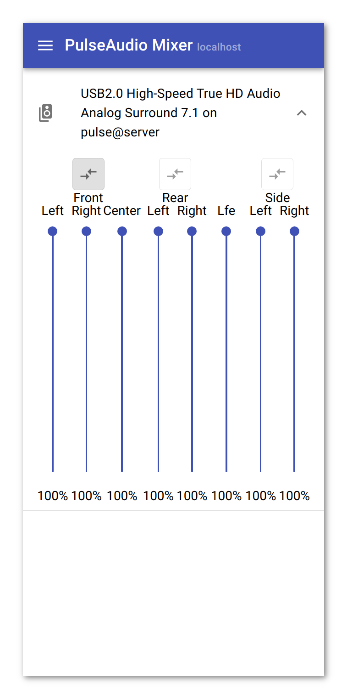

# react-pulse-mixer
A simple React-based mobile SPA to change volume levels of PulseAudio sinks using [rest-pulse-mixer](https://github.com/christianglodt/rest-pulse-mixer) as a backend.

## Use Cases
react-pulse-mixer was developed for PulseAudio setups that have multiple
clients, where the user would like to have a client-independent way of setting
the volume from their mobile device. An example would be a multi-room audio setup
with a central PulseAudio server used by several clients (eg. kodi, mpd).

## Installation
The preferred way to deploy react-pulse-mixer is using the [react-pulse-mixer-docker](https://github.com/christianglodt/react-pulse-mixer-docker)
docker image.

## User Interface
The mixer UI allows the adjustment of each individual channel of the chosen sinks.
Channels with the same prefix are grouped and can be adjusted jointly by toggling
the corresponding button:

The menu button in the toolbar opens the list of available sinks. Only sinks
that are starred are shown in the mixer UI.

## Persistence
The chosen sinks are saved in local storage only.
